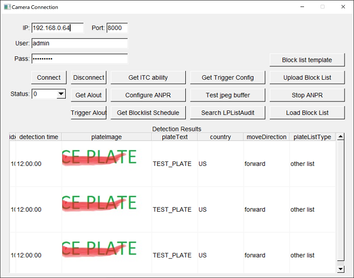

# Основные элементы управления

## Запуск режима распознавания номеров
Для запуска режима обнаружения номеров нужно подключиться к камере
с помощью кнопки "Connect" . Затем "Сonfigure ANPR" . Если все пройдет успешно то в таблице ниже будут появлятся скриншоты номеров с различной дополнительной информацией. Более новые записи появляются ниже в таблице. Информация о номерах сохраняется в базе данных SQLite  в папке с исполнимым файлом программы plate_detectoim.db. Файл базы данных можно удалить вручную после остановки программы. Для остановки режима распознавания нужно нажать кнопку Stop ANPR.

## Загрузка файла - черного/белого списков
Файл списка запрещенных / разрешенных номеров представляет собой 
файл бинарного формата Mictosoft Excel с расширением .xls . Нужен именно бинарный xls формат, 
а не более современный тексовый .xmlx .
Для загрузки шаблона файла списков служит кнопка Block List template. Файл сохраняется в 
текущей директории программы под названием black_white_list_template.xls
Для его редактирование нужно использовать Microsoft Excel. Для загрузки файла списков на 
сервер камеры служит кнопка Upload Block List, нужно сохранить файл под именем black_white_list_upload.xls также в текущей директории главного исполнимого файла программы. 
Для того чтобы изменения списков применились к процессу распознаванию номеров необходимо перезапустить процесс кнопками Stop ANPR / Configure ANPR.

## Чтение / триггер выхода

Для чтения состояния выхода служит кновка Get Alout. Результат отображается в элементе Status.
Для смены текущего состояния выхода служит кнопка Trigger Alout. Она вызывает переключение состояние выхода на противоположное 1 -> 0, 0 -> 1.

## Остальные кнопки нужны для различных экспериментальных функций

Дополнительные результаты комманд также отображаются на консольном окне (черное окно) в текстовом виде.

